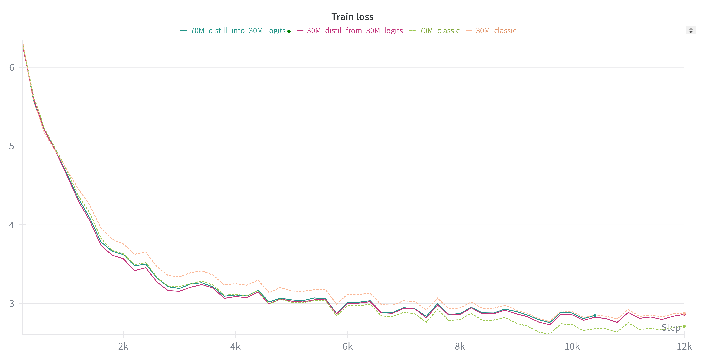
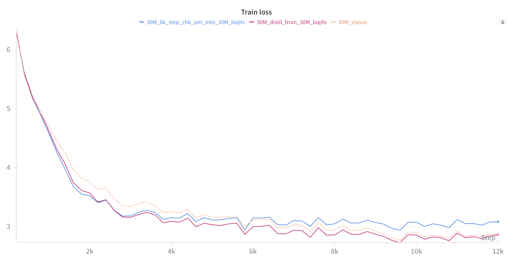
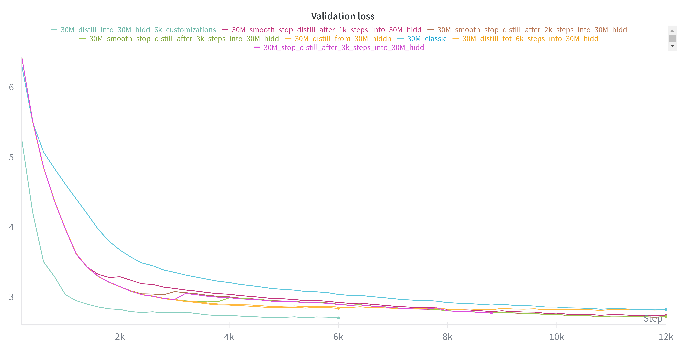
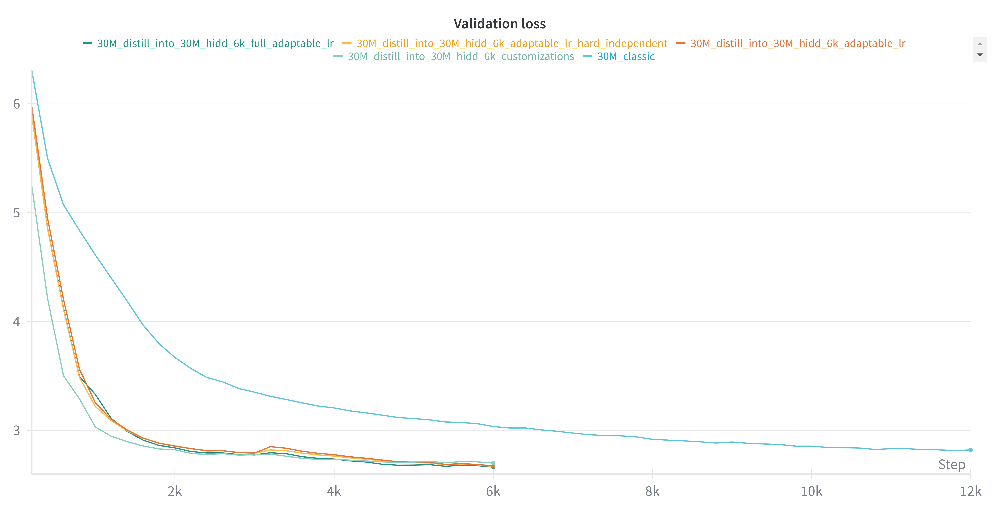
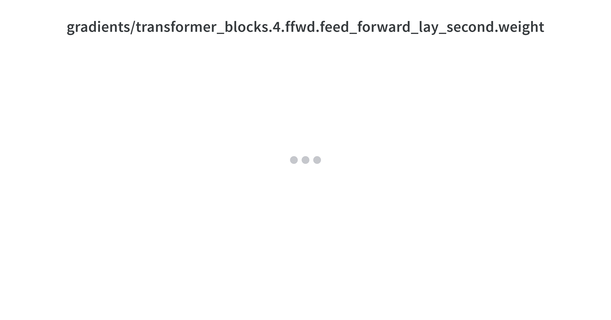
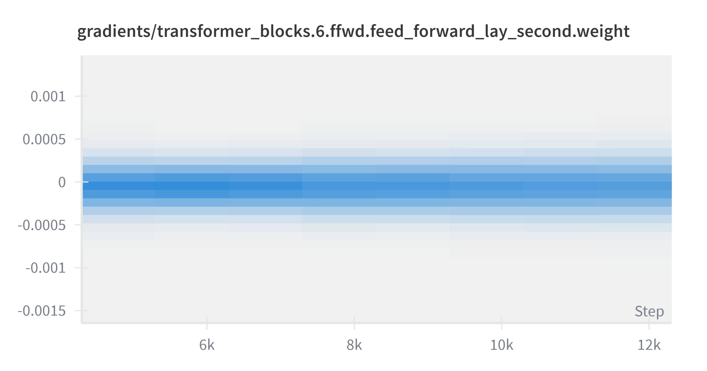
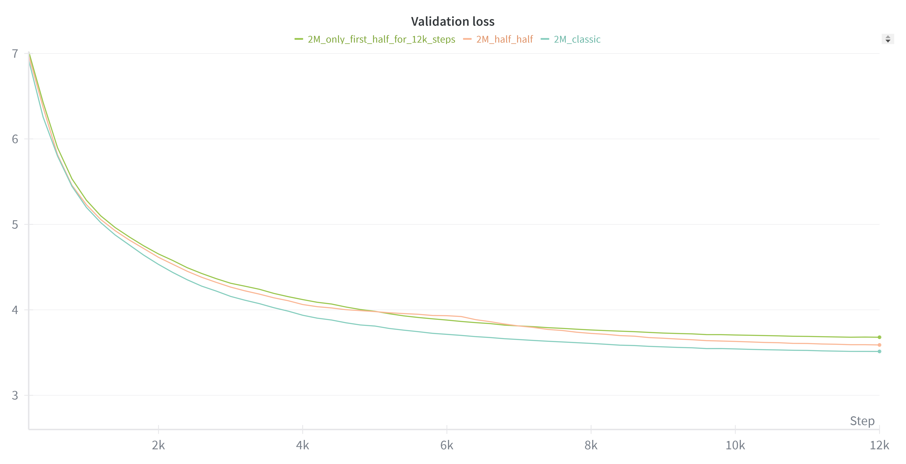

## Distill different teacher comparison study
Comparison of using different teachers on the same 30M param architecture, to see
how to they differ in their earlier training curves. They will probably
all converge to the same resulting loss.

### 30M distill into 30M baseline
When distilling from a fully trained 30M model, into a newly initialized 30M model with the same
architecture, the results are as shown:

Conclusion: Distillation significantly speeds up training speed, with hidd states distillation sticking out as the more effective method. However, benefits end soon with this training regime, the final performance gains seem to be the hardest. They seem to be bottle-necked by the learning rate scheduler. For lower loss values, more granular weight adjustments might be needed, for which a lower learning rate is needed. This suggests that careful learning rate management might be productive when incorporating distillation in training.

---

### 70M distill into 30M case
Will using a teacher with lower validation loss positively affect training?

Conclusion: doesn't perform better than having the trained 30M as a teacher. Strangely, in the first half of the training, it follows the training curve of the teacher 70M model quite precisely. After reaching roughly same loss as the 30M final loss, it plateaus.

---

### 30M intermediate checkpoint distill into 30M 
Using a not fully trained checkpoint of the 30M model, distill into freshly
initialized model.

Conclusion: Offers slightly faster training in the beginning (first 2k) in comparison to using the final checkpoint as a teacher. Later only proves to be a destructive loss interference.
Learned: The teacher is valid ONLY when it's loss is lower than the student's. The loss difference doesn't have to be large, e.g. even if it's 1% better, it can still be used as a teacher. BUT after the student reaches the teacher's loss, the distillation only interferes with training.

---

## Study deactivating teacher loss after a certain number of steps.
Retrying the 30M to 30M experiments, with more sophisticated training strategies. The distillation is only active for first 3k steps of training, and the total training steps is reduced from 12k to 6k. 

Conclusion 2.: After distillation has stopped, with regular training the new model is able to follow the training curve of the 30M to 30M distillation for the whole training. It seems that this cutoff at 3000 is a bit too harsh however, and a more linear transition may be necessary, which will not set back the training process, as it did in this case.
Conclusion 4.: I assume that the loss will just converge faster, as if 12k and 6k steps are equal, sort of, learning rate is indeed the bottleneck
Other Conclusions: Early hidden states distillation supports much higher learning rates, effectively speeding up early training, but is quickly bottle-necked by too high of a learning rate for lower loss values. Maximally effective distillation requires precise manipulation of the learning rate. Transitions between learning rates don't have to be smooth (can be jumps), because it seems that the optimizer AdamW can smoothen that out.
End of day thoughts and guidance for tomorrow: It seems I was technically able to reduce number of iterations it takes to reach target loss by 3x (from 12k steps to 4k steps). And this was done with only 2k distillation steps I believe. Maybe this can be improved even further, but careful learning rate management is necessary. I believe a more automatic learning rate scheduler may be useful, which I need to explore. I should probably implement attention distillation, and then try to replicate these results from hidd distillation with logits and or attention distillation. Then I think I can move on to try some self-distillation techniques. Oh yeah, I should also probably different try teacher sizes for logits and attn distillation, to see if they have any effect on the distillation speedup, or if the only thing that matters is validation loss. Furthermore, I should try and compare training with aux head but letting gradients flow back in, to see difference in performance, then that same with distillation from final head to single intermediate head. I should also try training only a couple of layers of a transformer, and then freezing those and appending more, to see how loss behaves and all, info about this could be crucial for any self-distillation hope.

---

## Learning rate regimes
It seems that no matter the learning rate regime, the newly trained model can't converge quicker than about 4.5k steps (as opposed to the 12k total steps it took to train the original model). Even though very rapid progress happens very early in training, further hidd state distillasion seems to have diminishing returns, and in fact negligible impact after a point in training. In retrospect, this might be because only the outputs of the hidden layers are distilled, while completely ignoring the final classification output and also the output of the embedding layer. This leads us to believe that the embedding layer simply takes time to catch up with the knowledge of inner transformer blocks. 

Conclusion: An adaptable learning rate seems to be the way to go, since it's tricky to manage distillation loss since it's so fast-changing. It does not fit the usual schedulers such as cosine or inverse square root at all.
Explanation: The green run, which seems to drop the fastest in the beginning, uses a custom lr scheduler, which was meticulously designed to have the exact learning rate needed for every 500 steps of training. The intermediate runs follow an automatic (cosine modified) learning rate scheduler, which seems to perform better than the custom scheduler in the end. This makes it a much more desirable solution, because it doesn't involve manual adjustments, and depends purely on the expected final loss value. 

---

## Attaching extra layers to an already trained network
By taking an already trained network, can we boost it's performance by freezing all it's weights except the LMHead, and inserting additional transformer layers before the LMHead? The hope is that by attaching these additional layers, we can get a cheap boost in performance, which reflects something between the "only first part" model size performance, and "first part + additional layers" model size. By doing this, we could perhaps gain the performance that would take the smaller network 80% of it's training, and distill from the new, bigger network, into the smaller network.
Experiment shows that when naively attaching new layers, the model is highly incentivized to essentially transform them into identity networks, and interfere as little as possible with the residual layout "highway" from the last previously trained layer, to the LMHead. As shown in the weight values below:

However, the experiment shows that even with the highly suppressed weight values of the newly added layers, the setup does indeed represent a "middle ground" between the full network performance trained from scratch, and the half network performance trained from scratch:

